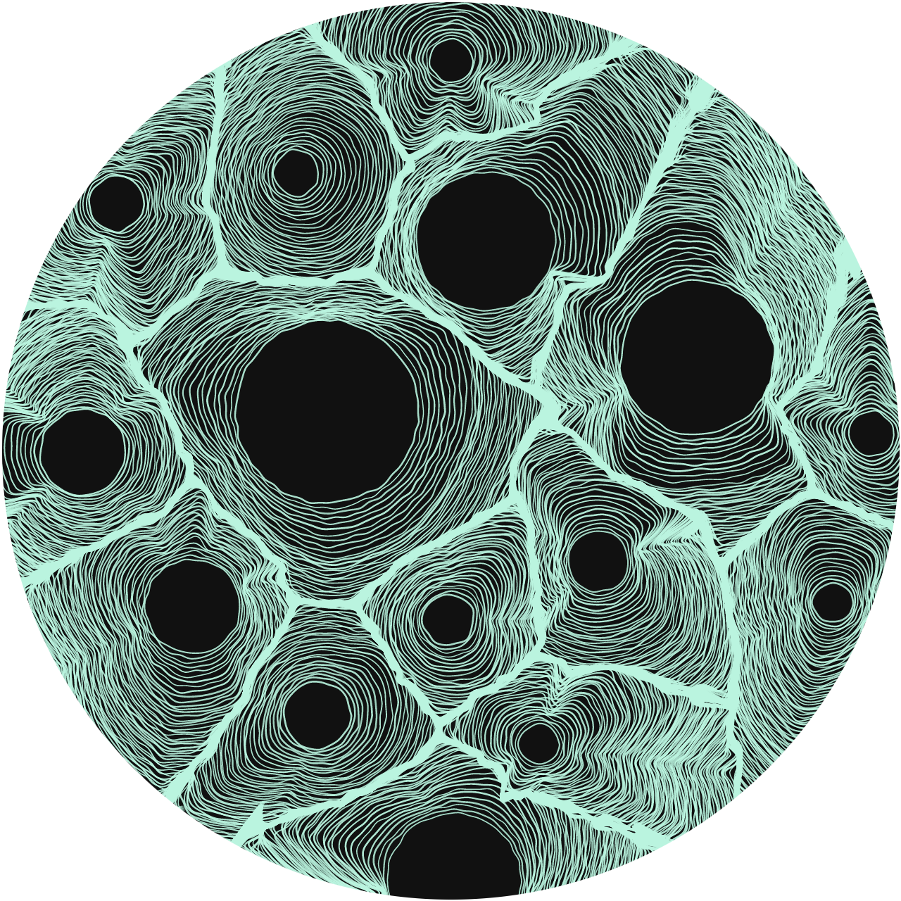

# Source code of DendroRithms



<p align="center">
  
</p>

**DendroRithms is a generative art installation inspired by tree growth rings.**

Every Dendro is uniquely generated from user input using an interactive minting
process. Buyers collectively decide the rarity and evolution of the artwork.

This repository contains the source code used to generate the Dendros.

## Getting started
This project is written in [Crystal](https://crystal-lang.org/). To run the
code, there are two options.

### 1. The Crystal Playground
The easiest way to get started is to use the online
[Crystal Playground](https://play.crystal-lang.org/#/cr). Paste the code found
in `dendro.cr` into the playground, uncomment lines 453 to 465 and click on
**Compile & run code**.

When it's done, copy the output on the left, paste it into an empty file and
save it as `dendro.svg`. You can open the resulting file in a browser,
Illustrator, Affinity Designer, Inkscape or any other Vector Graphics software.

### 2. Installing Crystal
Installing Crystal is a bit more complex, but you'll get the benefit of running 
the code on your computer and saving the output directly to a file. You'll find
the installation instructions for many different operating systems on the
[Crystal website](https://crystal-lang.org/install/).

## Getting playful
Once you're up and running, you can start playing with the code.

### Parameters
To generate a Dendro, you'll need four parameters.

#### `add_core` _`(Bool)`_
A boolean value, which can only be `true` or `false`.

**Note**: setting `add_core` to `true` will not always add a core. It will only
be added if there's enough space left on the canvas. The algorithm will try 500
times to find an open space.

#### `color` _`(Int32)`_
This property is defined by a number from `1` to `5`:
- `0` `#BAF4DE` (verdigris)
- `1` `#FFFFFA` (porcelain)
- `2` `#CAEFF7` (frost)
- `3` `#DFEDAE` (phosphor)
- `4` `#DEDAF1` (lilac)
- `5` `#E5B7A5` (copper)

#### `previous_cores` _`(String)`_
Every Dendro starts with the cores from the previous one in the same colour
chain. This property expects a JSON-formatted string. For example:

```json
[
  {"age":2,"cp":[20,43],"life":21,"max_r":6},
  {"age":1,"cp":[56,35],"life":20,"max_r":6}
]
```

The structure of the JSON itself is an array with objects. Every object has the
following properties:

- `age`: the current age of the core
- `cp`: center point, an array of two integer values representing [x, y]
- `life`: the maximum lifespan of the core
- `max_r`: the maximum radius of the core at middle age (50% life)

#### `seed` _`(Int32)`_
Dendros use a lot of randomness. We're using a deterministic random generator.
Giving the random generator a `seed` value, generally a number, will generate
the same random sequence on every run.

For the seed value, we use the Dendro's number. That's any number between `1`
and `3000`.

### Generating a specific Dendro
For this section, we're going to assume you've installed Crystal locally.

To generate a specific Dendro, look at the metadata of the one you want to
generate. For example, let's look at the metadata of [Dendro
0013](https://cardanoscan.io/transaction/2ae4c61ba19dd58fba4f32dfb446df80582f1ee0386af99c612f7ea52c67b3e5?tab=metadata).
Click on "Value" in the Metadata tab at the bottom of the page to see the data.
Under `previous_cores` you'll see:

```js
[
   {
      age: 1,
      cp: [
         48,
         11
      ],
      life: 21,
      max_r: 8
   }
]
```

**Note**: Unfortunately, none of the Cardano explorers displays the metadata as
JSON. Meaning the keys are not wrapped in double quotes. Valid JSON would be
`"age": 1` instead of `age: 1`. There's a small helper included in this repo to
fix this, so you'll only have to copy and paste what's given to you. 🎉️

Now, let's get started. Open the file called `playground.cr`. It has some
example code you can use as a starting point:

```cr
# Set variables here
add_core = true
color_id = 0
number = 1
previous_cores = Util.js_to_json <<-JSON
[
   {
      age: 1,
      cp: [
         48,
         11
      ],
      life: 21,
      max_r: 8
   }
]
JSON

# This part builds the Dendro
dendro = Dendro.new(
  seed: number,
  color: color_id,
  previous_cores: previous_cores,
  add_core: add_core
)

# This part writes the resulting SVG file to the 'playground' folder
File.write(Util.svg_file_name(number), dendro.to_svg)
```

Copy and paste the `previous_cores` from the metadata on Cardano Explorer
between `<<-JSON` and `JSON` and everything will work.

Now, to run the code:

```sh
crystal playground.cr
```

A Dendro with the specified settings will be generated and saved into the
playground folder.

#### Building the following Dendro
To create the following Dendro in the same colour chain, you can use the 
`current_cores_as_json` method on the previous one. For example:


```cr
number = 1
dendro_01 = Dendro.new(
  seed: number,
  color: color_id,
  previous_cores: previous_cores,
  add_core: add_core
)
File.write(Util.svg_file_name(number), dendro_01.to_svg)

number = 2
dendro_02 = Dendro.new(
  seed: number,
  color: color_id,
  previous_cores: dendro_01.current_cores_as_json, # <== 👀️
  add_core: add_core
)
File.write(Util.svg_file_name(number), dendro_02.to_svg)

# etc...
```

## FAQs

### Why Crystal?
Initially, this generator was written in JavaScript. Generating a Dendro
could take up to three minutes. Crystal is extremely fast and allowed us to
decrease that number to less than 15 seconds.

But there's more to Crystal than just speed. More info about its benefits can be
found on [their home page](https://crystal-lang.org/).

### How do I uncomment code?
Code comments are lines starting with a `#`. The compiler ignores them. You can
uncomment a line of code by removing the `#` in front of it.

## License
This project is open-source under the GNU Affero General Public License Version
3 (AGPLv3) or any later version. You can [find it here](LICENSE.md).
